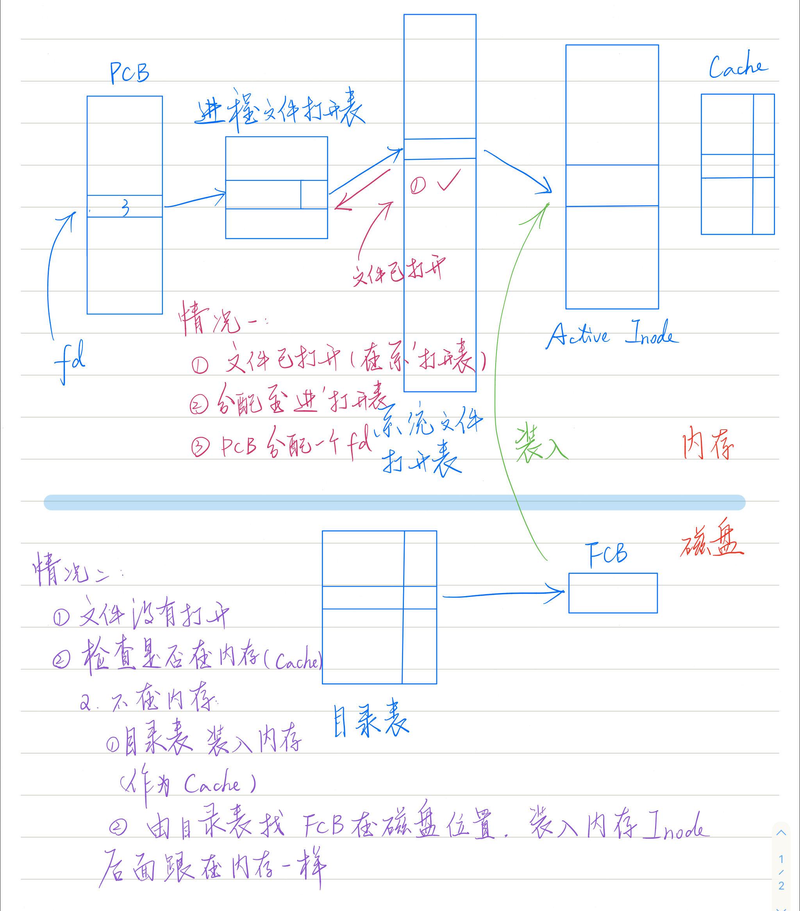

# 面试自问自答 - 操作系统

1. [Linux内存管理(最透彻的一篇)]https://www.cnblogs.com/ralap7/p/9184773.html

2. 进程与线程的关系

   > 一个线程只能属于一个进程，而一个进程可以有多个线程，但至少有一个线程;
   >
   > 资源分配: 给进程，同一进程的所有线程共享该进程的所有资源;
   >
   > 处理机分配: 给线程，即真正在处理机上运行的是线程;
   >
   > 进程之间可以并发执行，同一个进程的多个线程之间也可并发执行;
   >
   > 线程在执行过程中，需要协作同步。不同进程的线程间要利用消息通信的办法实现同步。

3. 进程与线程的区别

   > 调度与资源拥有: 进程是资源分配的独立单位; 线程是资源调度的独立单位; 
   >
   > 系统开销: 在创建或撤消进程时，由于系统都要为之分配和回收资源，导致系统的开销明显大于创建或撤消线程时的开销。

4. 进程

   > **程序段**、相关的**数据段**和PCB(**进程控制块**)三部分构成进程实体。所谓创建进程，实质上是创建进程实体中的PCB，撤销进程也是撤销进程中的PCB

5. PCB

   >1. 进程标识符pid
   >2. 处理机状态(现场信息): 当处理机被中断时，其寄存器的信息都必须保存在进程的PCB中，以便该进程重新执行时，能从断点继续执行。
   >3. 进程调度信息: 包括进程状态, 进程优先级, 进程调度所需的其他信息, 事件（进程由执行状态转变为阻塞状态所等待发生的事件，即阻塞原因）。
   >4. 进程控制信息: 包括**程序和数据的地址**, 进程**同步和通信机制**, 资源清单（除CPU以外的进程所需的全部资源以及已经分配到该进程的资源的清单），链接地址（本进程PCB所在队列中的下一个进程的PCB的首地址）。

6. 线程

   > 线程自己不拥有系统资源，只拥有一点在运行中必不可少的资源(每个线程有自己的程序计数器、虚拟机栈和本地方法栈, 同类线程共享进程的堆和方法区资源)
   >
   > 一个线程可以创建和撤消另一个线程，同一进程中的多个线程之间可以并发执行。

   线程的好处:

   > 易于调度;
   >
   > 开销少: 创建线程比创建进程要快，所需开销很少; 
   >
   > 提高并发性: 进程可创建多个线程来执行同一程序的不同部分。
   >
   > 利于充分发挥多处理器的功能: 通过创建多线程进程，每个线程在一个处理器上运行，从而实现应用程序的并发性，使每个处理器都得到充分运行; 

7. fork() 父进程创建子进程

   > 子进程复制父进程的程序/数据段, 在内核中重新申请一个pcb并用父进程的初始化

8. 进程间如何通信?

   > - 管道（PIPE）
   >   - 有名管道：一种半双工的通信方式，它允许无亲缘关系进程间的通信
   >     - 优点：可以实现任意关系的进程间的通信
   >     - 缺点：长期存于系统中，使用不当容易出错; 缓冲区有限
   >   - 无名管道：一种半双工的通信方式，只能在具有亲缘关系的进程间使用（父子进程）
   >     - 优点：简单方便
   >     - 缺点：局限于单向通信; 只能创建在它的进程以及其有亲缘关系的进程之间; 缓冲区有限
   >   
   > - 信号量（Semaphore）：作为**进程之间**及**同一种进程的不同线程之间**得同步和互斥手段。
   >
   >   信号量是一个计数器，可以用来控制多个线程对共享资源的访问
   >
   >   - 优点：可以同步进程
   >   - 缺点：信号量有限
   >
   > - 信号（Signal）：信号是在软件层次上对中断机制的一种模拟，它是比较复杂的通信方式，用于通知进程有某事件发生，一个进程收到一个信号与处理器收到一个中断请求效果上可以说是一致的
   >
   > - 消息队列（Message Queue）：是消息的链表，存放在内核中并由消息队列标识符标识, 克服了管道、信号量两种通信方式中信号量有限的缺点，具有写权限的进程可以按照一定得规则向消息队列中添加新信息；对消息队列有读权限得进程则可以从消息队列中读取信息。
   >
   >     - 优点：可以实现任意进程间的通信，并通过系统调用函数来实现消息发送和接收之间的同步，无需考虑同步问题，方便
   >     - 缺点：信息的复制需要额外消耗 CPU 的时间，不适宜于信息量大或操作频繁的场合
   >
   > - 共享内存（Shared Memory）：映射一段能被其他进程所访问的内存，这段共享内存由一个进程创建，但多个进程都可以访问
   >
   >     - 优点：无须复制，快捷，信息量大
   >     - 缺点：
   >             依靠互斥、同步操作: 通信是通过将共享空间缓冲区直接附加到进程的虚拟地址空间中来实现的，因此进程间的读写操作需要依靠同步操作，如互斥锁和信号量等;
   >             不方便网络通信: 利用内存缓冲区直接交换信息，内存的实体存在于计算机中，只能同一个计算机系统中的诸多进程共享, 不方便网络通信
   >
   > - 套接字（Socket）：可用于不同计算机间的进程通信
   >
   >     - 优点：
   >             传输数据为字节级，传输数据可自定义，数据量小效率高
   >             传输数据时间短，性能高
   >             适合于客户端和服务器端之间信息实时交互
   >             可以加密,数据安全性强
   >     -  缺点：需对传输的数据进行解析，转化成应用级的数据。

9. 线程之间怎么通信?

   > 线程间的通信目的主要是用于线程同步，所以线程没有像进程通信中的用于数据交换的通信机制
   >
   > - 锁机制：包括互斥锁/量(mutex), 读写锁(reader-writer lock), 自旋锁(spin lock), 条件变量(condition)
   >   - 互斥锁/量（mutex）：提供了以排他方式防止数据结构被并发修改的方法。
   >   - 读写锁（reader-writer lock）：允许多个线程同时读共享数据，而对写操作是互斥的。
   >   - 自旋锁（spin lock）与互斥锁类似，为了保护共享资源。互斥锁是当资源被占用，申请者进入睡眠状态；而自旋锁则循环检测保持者是否已经释放锁。
   >   - 条件变量（condition）: (条件变量始终与互斥锁一起使用) 可以以原子的方式阻塞进程，直到某个特定条件为真为止。对条件的测试是在互斥锁的保护下进行的。。
   > - 信号量机制(Semaphore)
   >   - 无名线程信号量
   >   - 命名线程信号量
   > - 信号机制(Signal)：类似进程间的信号处理
   > - 屏障（barrier）：屏障允许每个线程等待，直到所有的合作线程都达到某一点，然后从该点继续执行。
   >   

10. 多进程、多线程怎么选择?

   > 多进程: 编程、调试简单，可靠性较高(相互独立); 但: 创建、销毁、切换速度慢，内存、资源占用大;
   >
   > 多线程: 创建、销毁、切换速度快，内存、资源占用小; 但: 可靠性较差(一个线程挂其他受影响), 编程、调试复杂
   >
   > 
   >
   > 需要频繁创建销毁的优先用线程
   >
   > 需要进行大量计算的优先使用线程
   >
   > 强相关的处理用线程，弱相关的处理用进程
   >
   > 可能要扩展到多机分布的用进程，多核分布的用线程

11. 同步与互斥的区别

   > 同步主要是要实现有序访问(比如读入文件, 统计文件字数两个线程); 互斥侧重于排他性, 是无序访问

12. 死锁

    > 产生原因:
    >
    > 系统资源不足
    > 资源分配不当
    > 进程运行推进顺序不合适
    >
    > 
    >
    > 产生条件:
    >
    > 互斥
    > 请求且等待
    > 不剥夺
    > 环路
    >
    > 
    >
    > 预防:
    >
    > 打破互斥条件：改造独占性资源为虚拟资源，但大部分资源无法改造;
    >
    > 打破占有且申请条件：进程运行前申请全部资源，满足则运行，不然就等待，这样就不会占有且申请;
    >
    > 打破不可抢占条件：当一进程占有一独占性资源后又申请一独占性资源而无法满足，则退出原占有资源;
    >
    > 打破环路：有序资源分配法, 对所有设备实现分类编号，所有进程只能采用按序号递增的形式申请资源;
    >
    > 银行家算法: 
    >
    >  1. 如何判断当前状态安全?
    >
    >     每个进程已占有资源(Allocation)、请求支援(Need)、当前可用资源(Available): 能找到一个安全序列则安全
    >
    >  2. 有资源申请怎么处理?
    >
    >     1. 保证Requests[i]<=Need[i] (废话) ; 
    >     2. Requests[i]<=Available
    >     3. 假设把资源给该进程, 用上面方法尝试是否能找到安全进程运行序列, 即状态是否安全, 若安全则给资源, 否则不给

13. 进程的调度

    >  调度算法要考虑要的指标：反应时间, 平均等待时间, 是否公平, 实时
    >
    >  1. 批处理:
    >    1. FCFS(first come first served)
    >    2. 短作业优先(SJR)（SJR实际也是一种优先级调度）：平均等待时间肯定是最优的 但不能保证公平
    >    3. 彩票调度：公平 随机
    >  2. 交互式系统:
    >    1. 轮转调度(RR)：切成时间片(“时间片”概念相对于“上下文”) 执行完一个时间片的process去最后面 （平均等待时间不一定好 但响应好）
    >    2. 优先级调度
    >
    >       1. 缺点：低优先级的process可能永远拿不到cpu 
    >       2. 解决方案：Aging（年龄）随着等待时间增加优先级增加
    >    3. 多级队列调度：多个队列 每个队列有自己的调度算法
    >  3. 实时调度：硬实时(导航, 高铁自动驾驶)和软实时(早一点晚一点会有影响 但不是致命性错误)
    >  4. 其他分类方式:
    >    1. 非抢占式(拿到cpu就执行到完)和抢占式(来一个就打断 判断该由谁执行)
    >    2. 三级调度：接纳调度（是否进system）；内存调度（去内存还是disk）；cpu调度（最终执行调度）
    >    3. 线程调度：用户级线程调度（内核调用进程 运行时系统run-time system调用线程）和内核级线程调用（内核直接调用线程）

14. 僵尸进程 孤儿进程

    > 1. 孤儿进程：一个父进程退出，而它的一个或多个子进程还在运行，那么那些子进程将成为孤儿进程。孤儿进程将被init进程(进程号为1)所收养，并由init进程对它们完成状态收集工作。
    >    1. 孤儿进程结束, init进程会善后, 孤儿进程并不会有什么危害
    >
    > 2. 僵尸进程：一个进程使用fork创建子进程，如果子进程退出，而父进程并没有调用wait或waitpid获取子进程的状态信息，那么子进程的进程描述符仍然保存在系统中, 直到父进程通过wait / waitpid来取时才释放。这种进程称之为僵尸进程。
    >    1. 危害: 系统所能使用的进程号是有限的, 将因为没有可用的进程号而导致系统不能产生新的进程
    >    2. 解决: 信号机制;   **fork两次, 让init来处理僵尸进程**(当成孤儿进程)

15. 守护进程

    > 在linux系统中，在系统启动的时候有很多的进程就已经开始跑了，也称为服务，这也是我们所说的守护进程。
    >
    > 守护进程是脱离于终端并且在后台运行的进程，脱离终端是为了避免在执行的过程中的信息在终端上显示，并且进程也不会被任何终端所产生的终端信息所打断。也可以利用守护进程来完成很多的系统或者自动化任务。
    >
    > 
    >
    > 如何使用?
    >
    > 守护进程是脱离终端控制的，所以要造成一种在终端里已经运行完的假象，把所有的工作都放在子进程中去完成。所以要将父进程退出，子进程其实就是变成了孤儿进程, 由init进程收养
    >
    > 
    >
    > 特点:
    >
    > 在执行进程中的产生信息也不在任何终端上显示;
    >
    > 在关闭终端控制台时不会受影响;
    >
    > 守护进程的会话组和当前目录，文件描述符都是独立的

16. 内存碎片

   > 产生: 频繁地请求和释放不同大小的内存
   >
   > 解决方案:
   >
   > 1. 内存紧缩(不推荐, 浪费cpu时间)
   > 2. 利用分页单元把一组非连续的空闲页框映射到连续的线性地址
   > 3. 开发一种适当的技术来记录现存的空闲的连续页框块的情况，以尽量避免为满足对小块的请求而分割大的空闲快(比如Linux使用第二种: 伙伴系统; 1,2,4,8,16,32,64,128,256……1024页框链表, 有就分配,没有就找大的分割, 然后给小的; 逆过程是释放时不断合并)

17. 内存限制

    > 交换技术(可能造成上面的“内存碎片”)

    > 虚拟内存: 把程序分成多个页, 运行时只要将需要的页调入内存
    >
    > 虚地址是程序产生的地址, 而MMU  (内存管理单元) 把虚地址转换为物理地址;

18. 虚拟内存 (基于局部性原理, 同样用到该原理: 分页存储中逻辑地址转换的快表)

    > 1. 解决什么问题: 
    >    1. 一次性
    >       1. 大作业无法一次装入内存
    >       2. 高并发无法容纳所有作业
    >    2. 驻留性: 有大量暂时用不到的数据驻留内存造成浪费
    >    3. 共享内存
    >    4. 内存保护
    > 2. 容量
    >    1. 虚拟内存的最大容量是由计算机的地址结构（cpu寻址范围）确定的
    >    2. 虚拟内存的实际容量=min(内存和外存容量之和，cpu寻址范围)
    >    3. e.g. 地址为32位，按字节编址，内存为512MB，外存为2GB: 则分别为2^32(2^2 * 2^30) = 4G, 2G+512M
    > 3. 页表机制
    >    1. 与基本页表相比, 多了4个字段: 是否在内存; 访问次数(用于页面置换算法); 修改位(是否写外存); 外存地址
    > 4. 缺页中断机制
    >    1. 每当要访问的页面不在内存时(先看快表, 再看页表)，便产生一个**缺页中断**，然后由操作系统的**缺页中断处理程序**处理中断。此时缺页的进程阻塞，放入阻塞队列，调页完成后再将其唤醒，放回就绪队列。内存有空闲块则装入, 否则需要用页面置换算法(被换出的需要在快表中删除, 且看是否要写外存)

19. 离散分配存储管理包括?

    > 分页存储管理, 分段, 段页式

20. 页面查找有哪些方法?

    > 1. 普通页表 (MMU 虚地址(虚页号 + 页内偏移) -> 物理地址)
    > 2. 两级/多级页表 (虚页号换成“两个/多个页表域”)
    > 3. 快表/联想内存  TLB(translation lookaside buffer) 
    > 4. 倒置页表（减少了每一页表的内存，但增加了查找页时间，可用hashing）

21. 页面置换算法有哪些? 

    > 没有空闲页面时, 需要将某些页面移出内存, 好把当前需要的页面移进内存
    >
    > 
    >
    > 局部置换算法:
    >
    > 1. NRU（Not Recently Used）最近未使用 ：
    >    1. R位(read)和M位(modified) 4类(00,01,10,11) 
    >    2. 定期(20ms)把R位清零，故障时随机扔掉最小类中一个
    >    3. 优点:简单; 缺点: 性能不是最佳, 但也够用了
    > 2. FIFO：易实现，但是可能常用的被扔出去(加表尾，扔表头) (实际较少使用这种方法)
    > 3. Second Chance(第二次机会算法)：
    >    1. 是FIFO的改进
    >    2. R=0扔掉；R=1时把R置0，放在表尾(当成新加入)
    >    3. 缺点: 要在链表中移动页面
    > 4. Clock时钟算法
    >    1. 对Second Chance的改进: 只需要前移时钟指针, 不需要将(R==1的)back的页面移动到front
    > 5. LRU（Least Recently Used）最近最少使用：扔掉未使用中时间最长的
    >    1. 效果很好，但代价很昂贵，
    >    2. 具体两种实现:
    >       1. 维护一个页面链表(把使用的移到表头)，或者且每次访问内存都要更新链表（最近用的在表头，没怎么用的在表尾）
    >       2. 维护一个页面矩阵(硬件实现): 访问i，把i_row置1，i_col置0，最后看sum_row，多的常用，少的少用，扔掉少的 //行置1意思是刚用的自己满上，列置0意思是把别人都-1，这样刚用过就很多，而一直不被用就会一直被减，直至被遗忘
    >    3. 软件模拟：
    >       1. NFU（Not Frequently Used）：用过+1，缺点是NFU不过忘记任何事，以前常用的会一直不被扔
    >       2. 老化算法(Aging)：计数器右移，最左位=current_R
    >
    > 
    >
    > 全局置换算法:
    >
    > 1. 工作集算法: 工作集指的是最近k次内存访问说是用过的页面的集合, 维护一个寄存器,缺页时左移并移入当前页面 (但该技术开销大, 没被使用)
    > 2. 替代算法: 在内存的页表, 通过R和M位判断是否扔掉(类似下面WSCLOCK算法), 定期R清0
    > 3. WSClock（工作集时钟算法）：R=1时，跳过不扔但置0；R=0时，查看生存时间（实际已使用cpu时间），如果生存时间>τ，则置换；生存时间<τ，则暂时保留，如果扫描完整个页表其他都是R=1，有一个或多个该情况，则置换生存时间最长的。

22. 分页与分段的区别? + 内碎片与外碎片

    > 分页: 物理划分; 分段: 应用逻辑划分;
    >
    > 分页: 大小是系统固定的; 分段: 大小通常不固定。
    >
    > 分段不会产生内碎片，但连续存放段产生外碎片，可以通过内存紧缩来消除。相对而言分段空间利用率高。
    >
    > 内碎片: 被进程占用但实际用不到, 原因是分页是不是基于逻辑划分的, 比如最后一页经常就有用不到的

23. 段页式

    > 通常段比页大，因而段表比页表短，可以缩短查找时间，提高访问速度。
    >
    > 段号 + 页号 + 页内地址

24. 打开文件过程

    

25. 读文件/写文件过程

    > https://www.cnblogs.com/huxiao-tee/p/4657851.html
    >
    > 读文件
    >
    > 1、进程调用库函数向内核发起读文件请求；
    >
    > 2、内核通过检查进程的文件描述符定位到虚拟文件系统的已打开文件列表表项；
    >
    > 3、调用该文件可用的系统调用函数read()
    >
    > 3、read()函数通过文件表项链接到目录项模块，根据传入的文件路径，在目录项模块中检索，找到该文件的inode；
    >
    > 4、在inode中，通过文件内容偏移量计算出要读取的页；
    >
    > 5、通过inode找到文件对应的address_space；
    >
    > 6、在address_space中访问该文件的页缓存树，查找对应的页缓存结点：
    >
    > （1）如果页缓存命中，那么直接返回文件内容；
    >
    > （2）如果页缓存缺失，那么产生一个页缺失异常，创建一个页缓存页，同时通过inode找到文件该页的磁盘地址，读取相应的页填充该缓存页；重新进行第6步查找页缓存；
    >
    > 7、文件内容读取成功。
    >
    > 
    >
    > 写文件
    >
    > 前5步和读文件一致，在address_space中查询对应页的页缓存是否存在：
    >
    > 6、如果页缓存命中，直接把文件内容修改更新在页缓存的页中。写文件就结束了。这时候文件修改位于页缓存，并没有写回到磁盘文件中去。
    >
    > 7、如果页缓存缺失，那么产生一个页缺失异常，创建一个页缓存页，同时通过inode找到文件该页的磁盘地址，读取相应的页填充该缓存页。此时缓存页命中，进行第6步。
    >
    > 8、一个页缓存中的页如果被修改，那么会被标记成脏页。脏页需要写回到磁盘中的文件块。有两种方式可以把脏页写回磁盘：
    >
    > （1）手动调用sync()或者fsync()系统调用把脏页写回
    >
    > （2）pdflush进程会定时把脏页写回到磁盘
    >
    > 同时注意，脏页不能被置换出内存，如果脏页正在被写回，那么会被设置写回标记，这时候该页就被上锁，其他写请求被阻塞直到锁释放。	